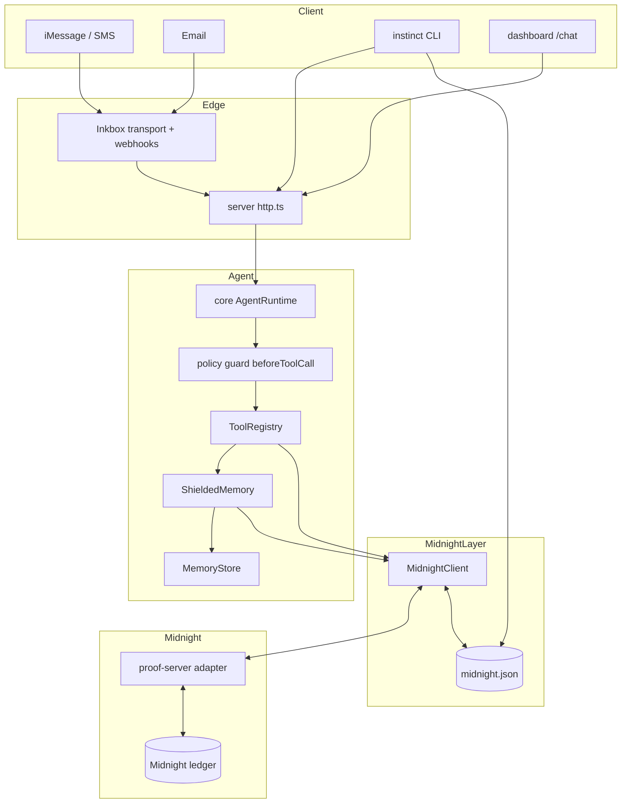
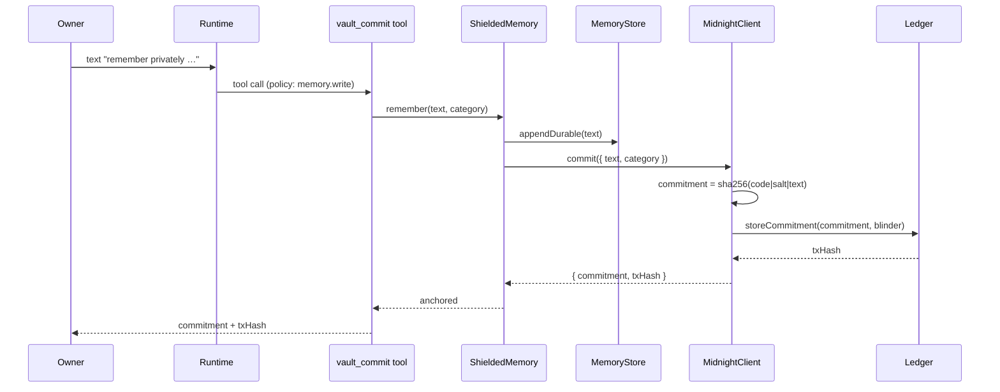

# System architecture: Midnight private agent

This document is the technical architecture for the Midnight privacy layer, as
extended from Open Instinct. It covers components, data flows, trust
boundaries, state, failure modes and the build/test story.

## 1. Component map



## 2. Where the new code sits

| Layer | Package | Change |
|---|---|---|
| Contracts | `contracts/` | new `memory-vault.compact`, `allowance-registry.compact` |
| Privacy package | `packages/midnight/` | new: client, commit scheme, shielded memory, tools, guidance |
| Runtime wiring | `packages/server/src/boot.ts` | registers midnight tools + guidance when configured |
| HTTP | `packages/server/src/http.ts` | `GET /midnight/status`, `midnight` in `GET /` |
| CLI | `packages/cli/src/commands/midnight.ts` | `init/list/status/prove/deploy` |
| Docs | `docs/MIDNIGHT.md`, `docs/ARCH-MIDNIGHT.md` | this set |

Nothing in `packages/core` changed. The Midnight layer reuses the existing
capability table (`memory.write`, `purchase`), the audit log and the prompt
pipeline unchanged, which is why the tier matrix and permissions docs stay
accurate.

## 3. Data flow: a private memory



## 4. Trust boundaries

| Boundary | Rule |
|---|---|
| Owner vs others | Only `kind === "owner"` may call the vault tools; enforced in each tool and by the capability table. |
| Agent vs wallet | The agent holds no seed phrase. The proof server signs; the agent only requests. |
| Plaintext vs ledger | Only commitments, category codes and tx hashes cross into the ledger. |
| Proof replay | Attestation ids are nullified on use. |
| Mock vs real | Mock tx hashes are prefixed `mock_` and never linked to an explorer. |
| Email owner | The pre-existing `owner:email` downgrade (partner tier) applies unchanged; email cannot settle approvals or reach the vault as owner. |

## 5. State

`midnight.json` under the data dir:

```json
{
  "version": 1,
  "vaultKey": "<16-byte hex, generated once>",
  "commitments": { "<commitment>": { "category": "health", "code": 1, "salt": "…", "txHash": "…", "at": "…" } },
  "nullifiers":  { "<attestationId>": { "commitment": "…", "disclosed": 1, "txHash": "…", "at": "…" } },
  "allowances":  { "<key>": { "maxCents": 5000, "spentCents": 3000, "active": true } }
}
```

The salt is the only secret needed to recompute a commitment, so the state file
is as sensitive as the memory it indexes. It lives in the same data dir as
`MEMORY.md`, which the owner already protects.

## 6. Failure modes

| Failure | Behaviour |
|---|---|
| Proof server down | Remote commit throws; `ShieldedMemory` still saved the plaintext locally and reports the anchor failed. No data loss. |
| Faucet / proving slow | Flip `MIDNIGHT_MODE=mock`; the demo keeps working with honest `mock_` hashes. |
| Unknown commitment on prove | Tool returns a clear error, no proof issued. |
| Allowance missing/exhausted | `allowance_check` returns `allowed:false`, not an error, so the agent asks the owner. |
| Misspelled `MIDNIGHT_MODE` | Falls back to mock rather than failing boot. |
| Midnight not configured | Layer is entirely absent; the agent behaves exactly as before. |

## 7. Build and test

```sh
pnpm run build      # all packages, dependency order
pnpm run test       # vitest per package (includes packages/midnight)
pnpm run smoke      # end-to-end agent flow with the faux model
node packages/midnight/scripts/prove-local.mjs
```

The smoke test runs with Midnight **off**, proving the default path is
unaffected. `packages/midnight/test/client.test.ts` covers the commitment
scheme, selective disclosure, replay resistance, allowance gating, persistence
and the shielded-memory integration against a real `MemoryStore`.

## 8. Extension points

- **More circuits**: the proof-server contract is generic (`POST /commit` takes
  a contract name), so a new named contract drops in without agent changes.
- **On-chain expiry**: v0 enforces allowance expiry in the agent; the ledger
  circuit takes a timestamp once the toolchain pin supports it.
- **Network auth for A2A proofs**: the OIP envelope already carries
  on-behalf-of metadata; a future circuit can bind a proof to an agent handle.
