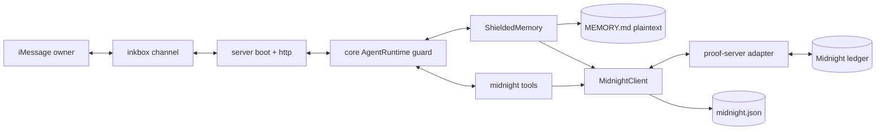
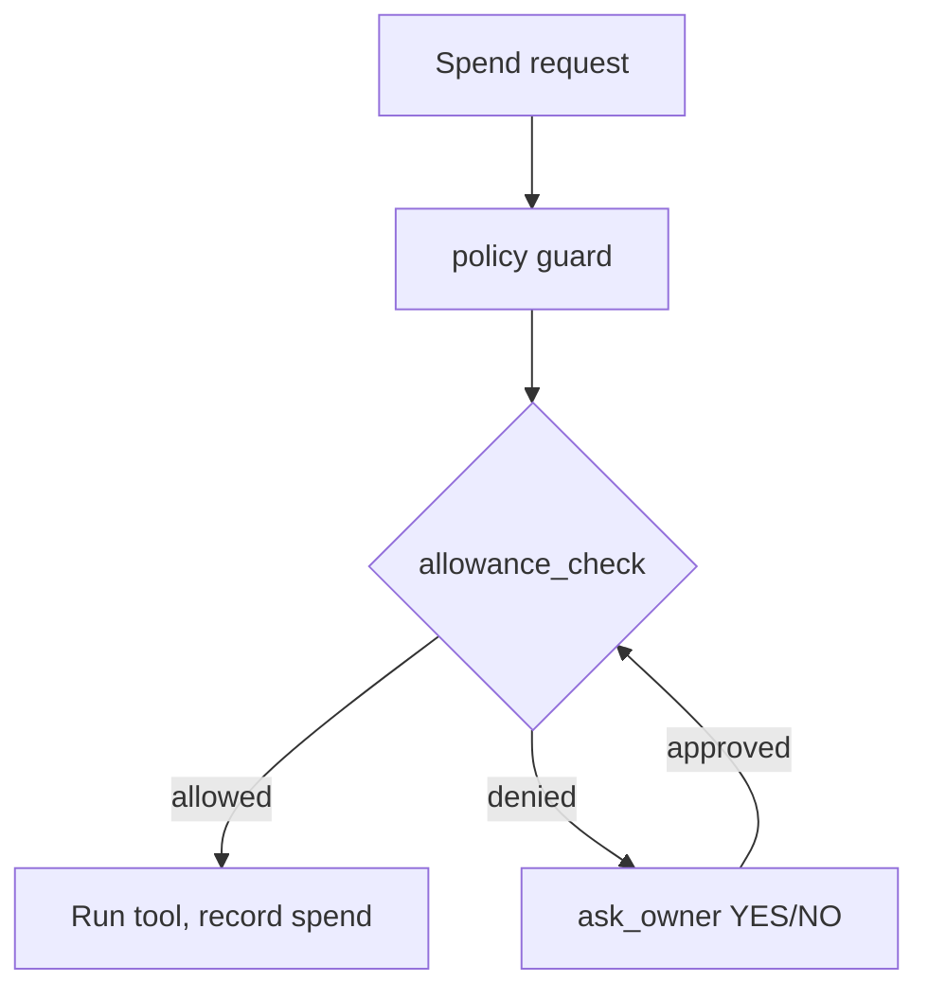

# Midnight private agent

Open Instinct normally keeps the owner's memory as plain markdown the owner can
read and edit. This document describes the optional **Midnight privacy layer**:
a shielded memory vault, selective-disclosure proofs, and ZK-gated allowances,
anchored on [Midnight](https://midnight.network/).

The whole point in one sentence: **the agent's words never leave the host; the
chain only ever sees opaque 32-byte commitments.**

## Why this exists

A personal agent is only trustworthy if its memory stays private. Storing notes
in a cloud database means the operator can read them. Midnight lets us prove
things *about* a memory — that it exists, that it is a health note — without
revealing the memory itself. This layer wires that capability into the agent the
owner already texts.

## Privacy guarantees

| Data | Where it lives | On-ledger? |
|---|---|---|
| Memory text | `memory/MEMORY.md` on the agent host | No |
| Preimage (`sha256(text)`) | Circuit input only | No |
| Commitment (`persistentCommit(preimage, salt)`, computed in-circuit) | Midnight ledger | Yes |
| Owner binding (`persistentCommit(ownerSecret, commitment)`) | Midnight ledger | Yes |
| Disclosed category code | Midnight ledger | Yes (1–5, or 0 for existence) |
| Spend amount | Public running total | Yes (the limit is what the circuit enforces) |

- **Nothing reversible** is on-chain. `persistentCommit` mixes the preimage
  with a fresh random salt, so even a guessable memory cannot be brute-forced
  from the ledger. Without the salt and text the commitment cannot be opened.
- **Proofs are single-use.** Each attestation id is nullified on use, so one
  proof cannot be replayed as two.
- **Plaintext never enters the prompt for anyone but the owner.** A non-owner
  can receive a category proof via the vault, never the text.

## Modes

| Mode | Network | Needs | Use |
|---|---|---|---|
| `mock` | none | nothing | Default. Deterministic offline anchoring. Demos, CI, smoke test. |
| `local` | midnight-local-dev | `MIDNIGHT_PROOF_URL` | Full proving round-trip on your machine. |
| `testnet` | Midnight testnet | `MIDNIGHT_PROOF_URL`, `MIDNIGHT_CONTRACT_ADDRESS` | Real transactions and explorer links. |

Mock anchors produce hashes of the form `mock_commit_…` so they are never
mistaken for real transactions. The agent boots in `mock` whenever
`MIDNIGHT_MODE` is unset, and the whole layer is **off** unless `MIDNIGHT_MODE`
(or a contract address) is present — so enabling it can never break a normal
boot.

## Architecture



The `MidnightClient` is the only component that talks to the proof server. The
agent process never holds a seed phrase; the proof server owns the wallet. This
is deliberate: an agent that gets prompt-injected cannot move funds, because it
cannot sign.

### Commit and prove flow

```mermaid
sequenceDiagram
  participant O as Owner (iMessage)
  participant A as Agent runtime
  participant M as MidnightClient
  participant P as Proof server
  participant L as Midnight ledger
  O->>A: remember privately I take medication X
  A->>A: memory_write-equivalent saves plaintext locally
  A->>M: vault_commit(text, health)
  Note over M,L: the circuit computes persistentCommit; only it can open it
  M->>P: POST /commit { preimage, salt }
  P->>L: commit(preimage, salt) -> persistentCommit; store + owner binding
  L-->>P: txHash
  P-->>M: { commitment, txHash }
  A-->>O: Saved privately as a health memory. Commitment 0x… tx 0x…
  O->>A: prove to my partner I have a health note, hide the name
  A->>M: vault_prove_reveal(commitment, health)
  M->>P: POST /attest { commitment, attestationId, category=1 }
  P->>L: attest(...); nullifier[attestationId]=true
  L-->>P: txHash
  A-->>O: Proof recorded. Verifier learns: health. Text stays local.
```

### Allowance gating (stretch)



## The proof-server adapter

The agent expects a small REST service that owns the wallet and runs Compact
artifacts. It is intentionally tiny so it can be swapped for the official
Midnight stack as the toolchain stabilizes.

| Endpoint | Body | Returns |
|---|---|---|
| `POST /deploy` | `{ contract: "memory-vault" \| "allowance-registry" }` | `{ address, txHash }` |
| `POST /commit` | `{ contract, preimage, salt }` | `{ commitment, txHash }` |
| `POST /attest` | `{ contract, commitment, attestationId, category }` | `{ txHash }` |
| `POST /allowance/authorize` | `{ contract, key, maxAmount }` | `{ txHash }` |
| `POST /allowance/spend` | `{ contract, key, amount }` | `{ txHash }` |
| `POST /allowance/revoke` | `{ contract, key }` | `{ txHash }` |

A local reference implementation backs these with `midnight-local-dev` for
development; a testnet implementation uses a funded wallet. Both are described
in `contracts/README.md`.

## Agent tools

| Tool | Capability | What it does |
|---|---|---|
| `vault_commit` | `memory.write` | Save a durable memory locally and anchor its commitment |
| `vault_prove_reveal` | `memory.write` | Selective-disclosure proof: category or bare existence |
| `vault_status` | `memory.write` | Mode, contract addresses, anchor counts |
| `allowance_check` | `purchase` | ZK-gated spend against an allowance (stretch) |

Capabilities are checked by the existing policy engine, so tiers keep working
unchanged: a stranger never sees these tools, a partner cannot commit, and only
the owner speaks for the vault.

## Running it

```sh
# Offline, no wallet, always works:
pnpm --filter @open-instinct/midnight run build
node packages/midnight/scripts/prove-local.mjs

# Local config:
export MIDNIGHT_MODE=mock          # or local / testnet
export MIDNIGHT_PROOF_URL=...      # local + testnet
export MIDNIGHT_CONTRACT_ADDRESS=0x...
export MIDNIGHT_EXPLORER_URL=https://explorer.midnight.network

instinct midnight init             # seed the vault key
instinct midnight status           # mode, contracts, counts
instinct midnight list             # commitments so far
instinct midnight prove 0x… --disclose health
```

## Verifying a proof

1. `instinct midnight list` shows each commitment with its category and tx hash.
2. Open the tx in the explorer (`MIDNIGHT_EXPLORER_URL`).
3. Confirm the ledger holds a 32-byte commitment and a category code — and no
   text. Recompute the commitment locally from the memory to confirm the
   binding.

## Demo script (what to show a judge)

1. Text the agent: *"remember privately that I take medication X daily."*
   → *"Saved privately as a health memory. Commitment 0x… anchored (tx 0x…)."*
2. *"what do you remember?"* (as the owner) → full recall from `MEMORY.md`.
3. *"prove to my partner I have a health note, but don't reveal it."*
   → selective-disclosure proof + tx. Verifier learns `health`, nothing else.
4. `instinct midnight list` → the commitment row, no plaintext.
5. Open the tx in the explorer → a hash and a category code, no words.
